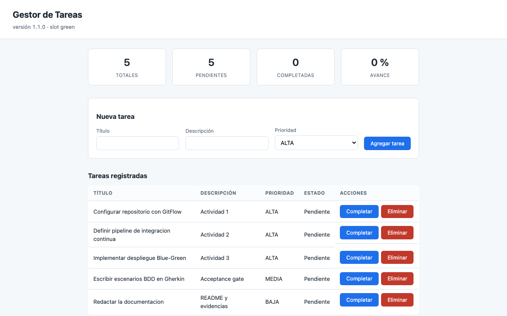

# Automatización de Pruebas — Examen Final

Proyecto del examen final de **Automatización de Pruebas**, Ingeniería en Informática.

Implementa, sobre una aplicación real y ejecutable, las tres actividades del examen:
un repositorio con flujo de ramas y build reproducible, un pipeline de integración
continua con dos niveles de prueba, y un deployment pipeline Blue-Green con
acceptance tests y rollback.

**Autor:** Carlos Salvo

---

## 1. Qué hay aquí

| Actividad | Qué se pedía | Dónde está |
|---|---|---|
| **1** | Repositorio Git con flujo de ramas + proyecto Maven con dependencias de pruebas | Ramas GitFlow de este repositorio · [`pom.xml`](pom.xml) |
| **2** | Pipeline de CI con stages de build y pruebas, mínimo dos tipos | [`.github/workflows/ci.yml`](.github/workflows/ci.yml) · [`Jenkinsfile`](Jenkinsfile) |
| **3** | Deployment pipeline con acceptance tests, despliegue y rollback o Blue-Green | [`scripts/desplegar.sh`](scripts/desplegar.sh) · [`docker-compose.yml`](docker-compose.yml) · [`.github/workflows/cd.yml`](.github/workflows/cd.yml) |
| **Doc** | README con estrategia, instrucciones y capturas | Este archivo · [`docs/evidencias/`](docs/evidencias) |

Nada de lo que se documenta aquí es teórico: cada pipeline, cada gate y cada
rollback se ejecutó de verdad, y la evidencia está en `docs/evidencias/`.

---

## 2. La aplicación bajo prueba

Un **gestor de tareas**: API REST más interfaz web, con persistencia.

No es el objetivo del examen, es el soporte. Se construyó porque las tres
actividades necesitan algo concreto que probar: sin una interfaz real no hay nada
que automatizar con Selenium, y sin lógica de negocio no hay nada que verificar
con pruebas unitarias.

| Elemento | Decisión | Por qué |
|---|---|---|
| Lenguaje | Java 21 LTS | El equipo tiene JDK 25/26 instalados, pero se fija una línea base estable: el mismo código compila igual hoy y dentro de un año. |
| Framework | Spring Boot 3.5 | API REST, interfaz web y health checks sin infraestructura adicional. |
| Persistencia | H2 en memoria | Cada arranque parte de un estado conocido, lo que mantiene idempotentes las suites. |
| Build | Maven con wrapper (`mvnw`) | El wrapper permite construir el proyecto sin tener Maven instalado. |

### Funcionalidad

Crear, listar, completar y eliminar tareas, con un tablero de avance. Las reglas
de negocio verificables son: título obligatorio, máximo 100 caracteres, y título
único sin distinguir mayúsculas.

### El endpoint que hace demostrable el Blue-Green

```
GET /api/version
{"version":"1.1.0","slot":"green","commitSha":"b9f4fdc","fechaBuild":"2026-09-16T02:16:35Z"}
```

Devuelve qué versión y qué slot están atendiendo la petición. Sin él, el despliegue
funcionaría igual pero no habría forma de *mostrar* que el tráfico cambió de una
versión a otra, ni de que volvió atrás tras un rollback. La misma información
aparece en la cabecera de la interfaz, de modo que una captura de pantalla sirve
como evidencia igual que un `curl`.

---

## 3. Actividad 1 — Repositorio y configuración Maven

### Flujo de ramas: GitFlow

```
main                    versiones liberadas, etiquetadas
 └── develop            integración continua de features
      ├── feature/*     una rama por unidad de trabajo
      ├── fix/*         correcciones de defectos encontrados
      └── release/*     preparación de una versión
```

Todas las integraciones se hacen con `--no-ff`, de modo que el historial conserva
la forma del trabajo en lugar de aplanarlo:

```bash
git log --oneline --graph --all
```

Hay además una rama `experimento/regresion-interfaz` **que nunca se integró**.
Contiene una regresión deliberada y existe como evidencia de la Actividad 3: es el
cambio que el Acceptance Test Gate rechazó. Que siga sin fusionarse es exactamente
lo que se espera del proceso.

### Dependencias de pruebas

Declaradas en [`pom.xml`](pom.xml) con versiones explícitas, nunca heredadas de
forma implícita:

| Dependencia | Para qué |
|---|---|
| JUnit 5 (Jupiter) | Motor de pruebas de los tres niveles |
| Mockito | Sustituye el repositorio en las pruebas unitarias |
| AssertJ | Aserciones legibles con mensajes de fallo útiles |
| Selenium WebDriver | Automatización del navegador en los acceptance tests |
| Cucumber | Escenarios BDD en Gherkin |
| RestAssured | Verificación del contrato HTTP en las pruebas de integración |
| JaCoCo | Medición de cobertura y gate del 80 % |
| SpotBugs | Análisis estático de código |

### Separación de los niveles por convención de nombre

Esto no es cosmético: define qué plugin ejecuta qué y en qué momento del ciclo.

| Patrón | Plugin | Fase | Nivel |
|---|---|---|---|
| `*Test.java` | Surefire | `test` | Unitarias |
| `*IT.java` | Failsafe | `verify` | Integración |
| `RunAcceptanceIT.java` | Failsafe, solo con `-Pacceptance` | `verify` | Aceptación (BDD) |

Los acceptance tests quedan tras un perfil porque **necesitan una aplicación ya
desplegada** contra la cual apuntar. Ejecutarlos en el `verify` habitual no tendría
sentido: no hay nada corriendo todavía.

---

## 4. Estrategia de pruebas

Tres niveles, cada uno respondiendo una pregunta distinta:

```
                    ┌─────────────────────────┐
                    │   9 escenarios BDD      │  ¿Sirve para lo que el
                    │   Selenium + Cucumber   │   negocio necesita?
                    └─────────────────────────┘
              ┌───────────────────────────────────┐
              │   12 pruebas de integración       │  ¿Las piezas encajan
              │   Spring + H2 + RestAssured       │   entre sí?
              └───────────────────────────────────┘
        ┌─────────────────────────────────────────────┐
        │   41 pruebas unitarias                      │  ¿Cada pieza hace
        │   JUnit 5 + Mockito                         │   lo suyo?
        └─────────────────────────────────────────────┘
```

**53 pruebas automatizadas y 9 escenarios BDD**, con **95,9 % de cobertura de
líneas** sobre un umbral exigido del 80 %.

### Por qué esta forma y no otra

La base es ancha y rápida a propósito. Las 41 unitarias corren en menos de dos
segundos y no tocan red, disco ni base de datos, de modo que pueden ejecutarse ante
cada cambio sin que nadie sienta la espera. Las de integración son más lentas porque
levantan el contexto de Spring y la base, así que van después. Los 9 escenarios BDD
son los más caros —abren un navegador real— y por eso se reservan para el momento
en que de verdad aportan: justo antes de promover una versión.

Cada nivel **atrapa lo que el anterior no puede ver**, y eso está demostrado, no
afirmado: la regresión de la Actividad 3 pasa las 41 unitarias sin problema y es
detenida por los escenarios BDD. La evidencia está en
[`03-gate-rechaza-version-defectuosa.txt`](docs/evidencias/03-gate-rechaza-version-defectuosa.txt).

### Idempotencia

Toda suite restaura su estado antes de ejecutarse. Las de integración vacían el
repositorio; los escenarios BDD dejan el tablero limpio usando la propia API
pública de la aplicación —no un acceso directo a la base—, porque el gate prueba el
sistema desplegado como una caja negra y no tiene por qué conocer sus credenciales.

Consecuencia práctica: la suite puede repetirse las veces que sea, en cualquier
orden, y siempre da el mismo resultado.

---

## 5. Actividad 2 — Pipeline de integración continua

Definido en [`.github/workflows/ci.yml`](.github/workflows/ci.yml), con un
equivalente en [`Jenkinsfile`](Jenkinsfile). Ambos se versionan junto al código: la
definición del proceso cambia por los mismos canales que el software y se puede
revisar y revertir igual que cualquier otro archivo.

```
  push / pull request
         │
         ▼
  ┌──────────────────────────────────────────┐
  │  ETAPA DE COMMIT                         │
  │   1. compilar                            │
  │   2. análisis estático (SpotBugs)        │  ← detiene ante cualquier hallazgo
  │   3. pruebas unitarias                   │
  │   4. gate de cobertura ≥ 80 %            │  ← detiene si baja del umbral
  │   5. empaquetar el artefacto             │
  └──────────────────────────────────────────┘
         │  solo si todo lo anterior pasó
         ▼
  ┌──────────────────────────────────────────┐
  │  PRUEBAS DE INTEGRACIÓN                  │
  │   contexto de Spring + base de datos     │
  └──────────────────────────────────────────┘
         │
         ▼
     resumen consolidado
```

### Criterios de diseño

**Fallar rápido.** Primero lo barato, después lo caro. Si alguien rompe la
compilación, se entera en segundos y no después de haber levantado una base de datos.

**Dos jobs, no uno.** Un pipeline monolítico obliga a leer un registro largo para
saber qué se rompió. Separados, el propio nombre del job que falla ya lo dice.

**Gates con umbral explícito.** La cobertura mínima está configurada en el `pom.xml`
y el build falla si no se alcanza. Un umbral que no bloquea es una sugerencia.

**Caché de dependencias.** Se cachea `~/.m2` entre ejecuciones. Es seguro porque
todas las versiones son explícitas: el caché acelera, no cambia el resultado.

---

## 6. Actividad 3 — Deployment pipeline Blue-Green

### El ambiente

```
                   ┌─────────────────┐
   usuarios ──────▶│   balanceador   │  nginx, puerto 8090
                   │     (nginx)     │
                   └────────┬────────┘
                            │  enruta a UNO de los dos
              ┌─────────────┴─────────────┐
              ▼                           ▼
     ┌────────────────┐          ┌────────────────┐
     │   app-blue     │          │   app-green    │
     │   slot azul    │          │   slot verde   │
     │   :8091        │          │   :8092        │
     └────────────────┘          └────────────────┘
```

Los dos slots **corren siempre**. Lo único que cambia al desplegar es a cuál apunta
el balanceador. De ahí viene la propiedad más valiosa del patrón: **el rollback es
instantáneo porque la versión anterior nunca se apagó**, quedó en stand-by.

Los puertos 8091 y 8092 exponen cada slot directamente. No son para usuarios: son
para que el Acceptance Test Gate pueda probar la versión nueva *antes* de que reciba
tráfico real.

### El pipeline

```
  1. EMPAQUETAR        construye el .jar y la imagen etiquetada con la versión
         │
  2. DESPLEGAR         al slot INACTIVO; el slot activo sigue atendiendo usuarios
         │
  3. HEALTH CHECK      ¿el slot nuevo levantó correctamente?
         │
  4. ACCEPTANCE GATE   9 escenarios BDD con Selenium contra el slot nuevo
         │
  5. DECISIÓN
     ├── aprueba  ──▶  conmutar el tráfico; el slot anterior queda en stand-by
     └── rechaza  ──▶  el tráfico NO se mueve; la versión queda aislada
```

**El punto central:** la decisión de promover no depende de que el despliegue haya
funcionado técnicamente, sino de que la versión nueva cumpla los criterios de
aceptación del negocio. Un despliegue puede ser perfecto y aun así no merecer
tráfico.

### Dos formas de volver atrás, que no son lo mismo

| Situación | Qué ocurre | Estado del tráfico |
|---|---|---|
| El gate **rechaza** antes de promover | El tráfico nunca se movió; la versión queda desplegada pero aislada, disponible para diagnóstico | Nunca estuvo en riesgo |
| Se detecta un problema **después** de promover | `rollback.sh` devuelve el tráfico al slot anterior | Vuelve en segundos |

Esta distinción importa y es fácil de equivocar. En el primer caso **no corresponde
ejecutar un rollback**: conmutar el tráfico en ese momento lo enviaría justamente
hacia la versión que acaba de ser rechazada.

### Auditoría

Cada acción queda registrada en
[`docs/evidencias/auditoria-despliegues.log`](docs/evidencias/auditoria-despliegues.log)
con momento, versión, slot, commit, rama y resultado:

```
2026-09-16T02:09:41Z | DESPLIEGUE-INICIO  | version=1.1.0 | slot=green | commit=d687609 | iniciado
2026-09-16T02:10:12Z | DESPLIEGUE-OK      | version=1.1.0 | slot=green | commit=d687609 | PROMOVIDO tras aprobar el gate
2026-09-16T02:10:23Z | ROLLBACK           | version=1.0.0 | slot=blue  | commit=d687609 | COMPLETADO
2026-09-16T02:11:17Z | DESPLIEGUE-RECHAZADO | version=1.2.0 | slot=green | commit=acb259c | RECHAZADO por el Acceptance Gate
```

Sin este registro, un rollback exitoso no dejaría ninguna huella de haber ocurrido.

---

## 7. Cómo ejecutar

### Requisitos

Docker, y nada más. El JDK y Maven los resuelve el wrapper; el driver de Chrome lo
resuelve Selenium Manager.

### Las pruebas

```bash
# Pruebas unitarias + gate de cobertura (~5 segundos)
./mvnw test

# Unitarias + integración (~20 segundos)
./mvnw verify

# Análisis estático
./mvnw spotbugs:check
```

### El ambiente de prueba

```bash
# Levantar el ambiente completo con la versión base
./scripts/levantar-ambiente.sh 1.0.0

# Ver qué slot recibe tráfico y qué versión sirve cada uno
./scripts/estado.sh
```

La aplicación queda en <http://localhost:8090>.

### Un despliegue completo

```bash
# Despliega en el slot inactivo, corre el gate y promueve solo si aprueba
./scripts/desplegar.sh 1.1.0
```

### Rollback

```bash
./scripts/rollback.sh "motivo del rollback"
```

### Los acceptance tests por separado

Requieren un ambiente ya levantado:

```bash
./mvnw verify -Pacceptance -Dacceptance.url=http://localhost:8090
```

### Reproducir el rechazo del gate

```bash
git checkout experimento/regresion-interfaz
./scripts/desplegar.sh 1.2.0     # el gate rechaza; el tráfico no se mueve
```

### Desmontar

```bash
docker compose down -v
```

---

## 8. Evidencias

Todo en [`docs/evidencias/`](docs/evidencias):

| Archivo | Qué demuestra |
|---|---|
| [`01-despliegue-exitoso.txt`](docs/evidencias/01-despliegue-exitoso.txt) | Pipeline completo: la 1.1.0 pasa el gate y recibe tráfico |
| [`02-rollback.txt`](docs/evidencias/02-rollback.txt) | Rollback devolviendo el tráfico de la 1.1.0 a la 1.0.0 |
| [`03-gate-rechaza-version-defectuosa.txt`](docs/evidencias/03-gate-rechaza-version-defectuosa.txt) | Las 41 unitarias pasan, el gate rechaza, el tráfico no se mueve |
| [`04-aplicacion-slot-blue.png`](docs/evidencias/04-aplicacion-slot-blue.png) | Interfaz sirviendo la versión 1.0.0 desde el slot azul |
| [`05-aplicacion-slot-green-tras-despliegue.png`](docs/evidencias/05-aplicacion-slot-green-tras-despliegue.png) | La misma URL sirviendo la 1.1.0 desde el slot verde |
| [`auditoria-despliegues.log`](docs/evidencias/auditoria-despliegues.log) | Traza completa de despliegues, promociones y rollbacks |

### El despliegue, visto desde el navegador

Antes y después son **la misma URL**. Lo que cambió es a dónde enruta el balanceador:

| Antes del despliegue | Después del despliegue |
|---|---|
|  |  |
| `versión 1.0.0 · slot blue` | `versión 1.1.0 · slot green` |

---

## 9. Problemas encontrados durante la construcción

Se dejan documentados porque forman parte del trabajo real, y porque algunos son
trampas que no se ven venir.

**El gate de aceptación no podía fallar.** Failsafe reportaba `Tests run: 0` y daba
`BUILD SUCCESS` aunque hubiera escenarios rojos: el motor de suite de JUnit Platform
no propaga los resultados de Cucumber a su reporte agregado. Un gate que no puede
detener el pipeline no es un gate. La decisión se tomó sobre el reporte que Cucumber
sí publica correctamente, mediante
[`verificar-aceptacion.sh`](scripts/verificar-aceptacion.sh).

**El rollback iba hacia el lado equivocado.** La primera versión del pipeline
invocaba `rollback.sh` cuando el gate rechazaba. Como el gate corre *antes* de
promover, eso conmutaba el tráfico hacia la versión defectuosa: exactamente lo
contrario de lo buscado. Ante un rechazo lo correcto es reafirmar el estado estable,
no cambiarlo.

**El balanceador se caía al cambiar de rama.** nginx respondía que
`/etc/nginx/nginx.conf` no existía, aunque el archivo estaba ahí. Un bind mount
queda atado al inodo, y git no edita los archivos sino que los reemplaza; al cambiar
de rama el contenedor quedaba apuntando a un inodo muerto. Montar el directorio en
vez del archivo tampoco bastó, porque git recrea también el directorio. La
configuración vive ahora en un volumen de Docker, fuera del alcance de git.

**El gate de cobertura contaminaba el despliegue.** El script de despliegue
empaqueta con `-DskipTests`, pero JaCoCo seguía enlazado a la fase `test` y evaluaba
el archivo de cobertura que hubiera quedado de una corrida anterior. El mismo commit
podía pasar o fallar según qué hubiera en `target/`. La cobertura se verifica donde
efectivamente corren las pruebas: en la etapa de commit.

**Pruebas intermitentes por carreras de navegación.** El formulario se envía por POST
y la aplicación responde con una redirección, de modo que el navegador atraviesa un
documento intermedio. Localizar un elemento en ese instante producía fallos de
*stale element*. Se resolvió esperando a que el documento anterior quede obsoleto y
a que `document.readyState` sea `complete`, con reintento acotado en lugar de
alargar las esperas a ciegas.
